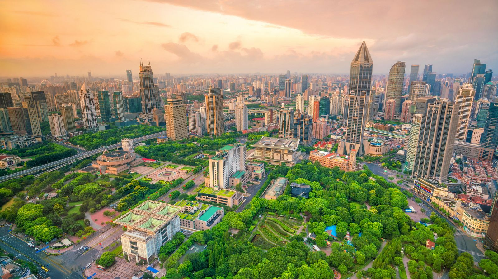
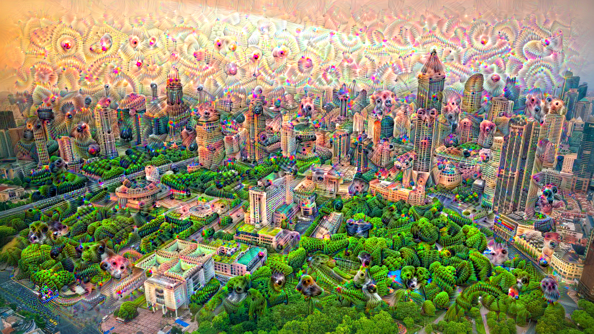

# Deep Dream
## Introduction
In this notebook we are going to implement **Deep Dream** algorithm in **Keras**. This algorithm allows to generate art-like images from an initial image by adding activations filters through the process of gradient ascent of the trained model:

